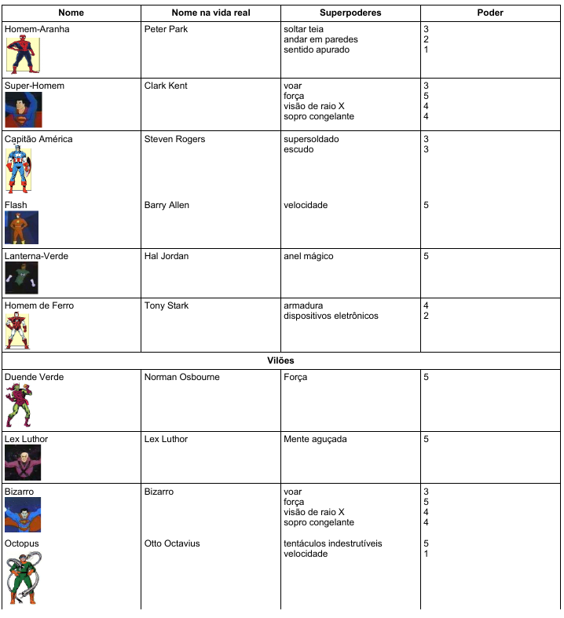

# Aula 02 (25/02) - Super-Heróis e Vilões - Atividade

Os super-heróis são personagens fictícios dotados de poderes sobre-humanos. Criados pela imaginação do homem, eles estão sempre em alerta para proteger o mundo dos ataques de mentes cruéis que pretendem dominar o nosso planeta. 

Cada super-herói tem uma origem interessante. Alguns, como o Incrível Hulk, o Capitão América e o Homem de Ferro, surgiram em laboratórios, e eram pessoas comuns antes de adquirirem seus superpoderes a partir de acidentes ou experiências com raios-gama, reações químicas e estudos científicos nos campos da física, engenharia e biologia. Outros, como o Super-Homem e o Lanterna-Verde, vieram de outros planetas. Existem ainda aqueles que se originaram da mitologia grega, romana ou nórdica, como é o caso do Thor e a Mulher-Maravilha. 

Os primeiros super-heróis apareceram entre 1930 e 1960, e o desenho em quadrinhos foi o principal veículo de divulgação em massa, antes da chegada da televisão. As principais empresas do ramo são a Hanna-Barbera, produtora da afamada Liga da Justiça (Super-amigos, 1973) e a Marvel, criadora de dezenas de personagens "vivos" até hoje.

Em quase todas as histórias inventadas, o super-herói é chamado para resolver um problema ou enfrentar ameaças de um vilão com um plano maligno. O vilão também é munido de superpoderes mas dificilmente consegue vencer o super-herói, pois os poderes deste são mais fortes.

Na lista abaixo são citados alguns super-heróis e alguns vilões, dos quais indubitavelmente já ouvimos falar. A lista apresenta também o nome na vida real e os superpoderes de cada um. Os superpoderes foram categorizados de 1 a 5, sendo 5 o poder mais forte e 1 o poder mais fraco.



## MISSÃO

1. Construir uma classe chamada Superpoder contendo: 
   - Atributos: 
     - nome: String
     - poder: int
   - Métodos:
     - getNome() : retorna o nome do poder
     - getPoder() : retorna o poder
     - imprime() : imprime os valores dos atributos
     - Construtor
        - ```Superpoder(String nome, int poder)``` 
        Recebe o nome do poder e valor e inicializa valores dos atributos.
  
2. Construir uma classe denominada Personagem contendo:
   - Atributos: 
     - nome: String
     - nomeVidaReal: String
     - poderes: vetor contendo elementos do tipo Superpoder
   - Métodos:
     - getNome() : retorna o nome do personagem
     - getNomeVidaReal() : retorna nome vida real
     - ```void adicionaSuperpoder(Superpoder sp)``` : recebe um superpoder como parâmetro
e coloca-o no vetor ```poderes```.
     - ```int getPoderTotal()``` : retorna a soma de poderes do super-herói. O poder total é calculado percorrendo o vetor ```poderes``` somando cada poder.
     - imprime() : imprime os valores dos atributos e lista de poderes.

     - Construtor
        - ```Personagem(String nome, String nomeVidaReal)``` 
        Recebe os nomes do personagem e inicializa os atributos.
   
3. Construir uma classe denominada Arena contendo:
   - Atributos: 
     - nome: String
     - qtdeConfrontos: int
   - Métodos:
     - getNome() : retorna o nome da arena
     - imprime() : imprime os valores dos atributos: nome e qtdeConfrontos
     - ```int executar (Personagem p1, Personagem p2)```
       o método recebe dois personagens como
parâmetros e decide quem é o vencedor da batalha. O método deve retornar:
            1 se personagem 1 ganha a batalha
            2 se personagem 2 ganha a batalha
            0 se houver empate.
   - Construtor
        - ```Arena(String nome)``` 
        Recebe o nome da arena e inicializa os atributos. 