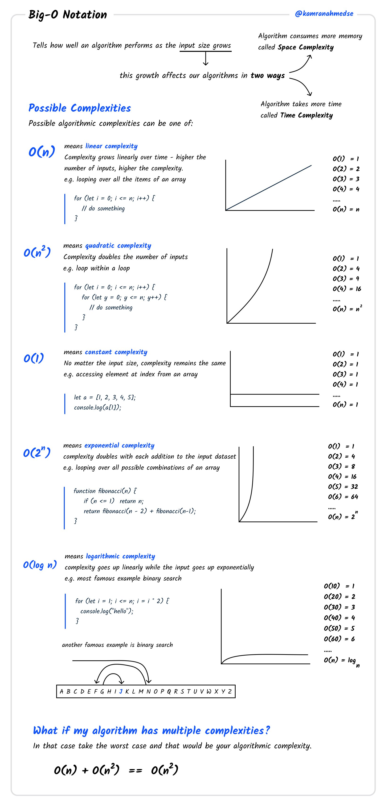

# Aula 06 (01/04) - Análise de Algoritmos

## Crescimento Assintótico de Funções

O crescimento assintótico de funções, ou notação assintótica, é uma ferramenta para analisar o comportamento de funções quando o tamanho da entrada (n) cresce indefinidamente, focando no termo de maior ordem e ignorando constantes e termos de menor ordem. 

De modo mais geral, o adjetivo assintótico significa para todos os valores suficientemente grandes.

#### O que é?

Ao ver uma expressão como  $n+10$  ou  $n²+1$,  a maioria das pessoas pensa automaticamente em valores pequenos de $n$. A análise de algoritmos faz exatamente o contrário: ignora os valores pequenos e concentra-se nos valores enormes de n. Para valores enormes de $n$, as funções

$n^2$,  $(3/2) n^2$,  $9999 n^2$,  $n^2/1000$,  $n^2+100n$,  etc.

têm todas a mesma taxa de crescimento e portanto são todas equivalentes.

A matemática que se interessa apenas pelos valores enormes de $n$ é chamada assintótica (= asymptotic). Nessa matemática, as funções são classificadas em ordens assintóticas. 

#### Notação Assintótica

A notação assintótica, como **Big O (O)**, **Big Omega (Ω)** e **Big Theta (Θ)**, permite comparar o crescimento de funções e, por extensão, a eficiência de algoritmos, quando a entrada se torna muito grande. 

#### Porquê é importante?

Em vez de analisar o tempo de execução exato de um algoritmo, a notação assintótica permite focar no seu comportamento limite, ou seja, como o algoritmo se comporta à medida que a entrada cresce. 

#### Notações:

**Big O (O):** Limite superior. Indica o crescimento máximo da função. Por exemplo, se um algoritmo tem Big O de O(n²), significa que o tempo de execução não cresce mais rápido do que n². 

**Big Omega (Ω):** Limite inferior. Indica o crescimento mínimo da função. Por exemplo, se um algoritmo tem Big Omega de Ω(n), significa que o tempo de execução cresce pelo menos tão rapidamente quanto n.

**Big Theta (Θ):** Limite exato. Indica o crescimento da função de forma precisa. Por exemplo, se um algoritmo tem Big Theta de Θ(n), significa que o tempo de execução cresce exatamente como n. 

#### Exemplo:

Considere a função f(n) = 2n² + 5n + 1. Em notação assintótica Big O, podemos dizer que f(n) = O(n²) porque o termo de maior ordem é n² e os outros termos e constantes são irrelevantes para o crescimento da função quando n é grande. 

#### Simplificação:

A notação assintótica permite simplificar a análise de algoritmos, ignorando termos de menor ordem e constantes, focando no comportamento limite. 

Na prática, isso significa dizer que podemos:

* ignorar as constantes;
* ignorar os expoentes de menor magnitude.

#### Aplicações:
A notação assintótica é amplamente utilizada na análise de algoritmos, permitindo comparar a eficiência de diferentes algoritmos e escolher o mais adequado para um determinado problema. 

#### Resumo

