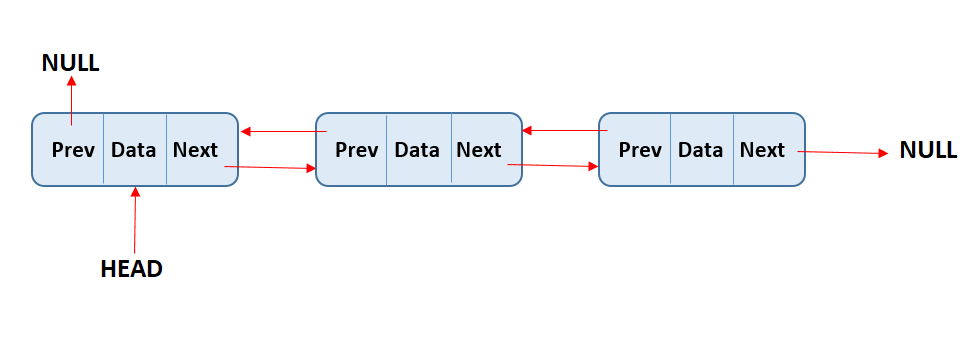

# Aula 11 (13/05) - Alocação dinâmica de memória 

O que é uma lista encadeada?

Uma **lista encadeada** é uma estrutura de dados linear onde cada elemento, chamado nó, contém uma referência (ou ligação) para o próximo nó (e/ou anterior) na sequência. Ao contrário de arrays, listas encadeadas não armazenam elementos em locais de memória contíguos. Isso permite inserções e exclusões eficientes em qualquer posição da lista.

**Estrutura de um Nó**

Um nó típico em uma lista encadeada simples contém:

**Dados:** O valor armazenado no nó.
**Próximo:** Um ponteiro ou referência para o próximo nó na lista.

Visualização de uma lista encadeada Simples:

~~~java
class Node {
    int data;
    Node next;
}
~~~

Cada nó contém dados e uma única referência ao próximo nó. A próxima referência do último nó é nula.

**Características:**

- Estrutura simples.
- Inserção e exclusão eficientes no início.
- A travessia é apenas para frente.

**Lista Duplamente Encadeada**

~~~java
class Node {
    int data;
    Node prev;
    Node next;
}
~~~

Cada nó contém dados e referências ao próximo nó e ao nó anterior. A referência anterior do primeiro nó é nula. A próxima referência do último nó é nula.

